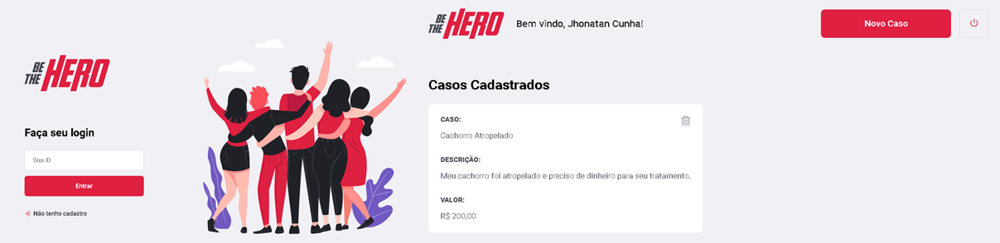
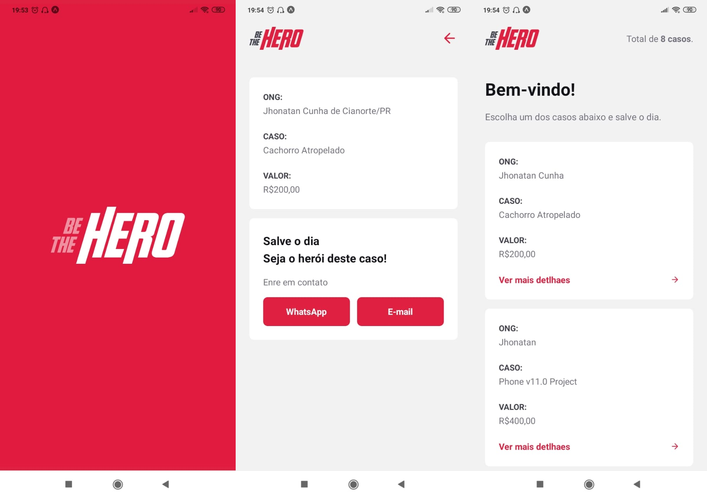

<h1 align="center">
    
</h1>

<h2 align="center">Seja um herói, apoie ONG's em suas causas!</h2>

## 🚀 Tecnologias

- [Node.js]
- [Express]
- [Sequelize]
- [ReactJS]
- [React Native]
- [Expo]


## Recursos
* A ONG poderá fazer login via ID.
* A ONG poderá cadastrar os casos.
* A ONG poderá disponibilizar o seu e-mail ou whatsapp para contato.
* O Usuário poderá ver os casos na versão mobile.
* O Usuário poderá entrar em contato com a ONG.

## ❓ Como utilizar?

### Instalação

```bash
$ cd be-the-hero
$ cd frontend 
$ yarn
```

```bash
$ cd ..
$ cd backend
$ yarn
```

### Como inicializar o front-end e back-end

```bash
$ cd frontend
$ yarn start
```

> Em outro terminal execute os seguintes comandos:

```bash
$ cd backend
$ yarn sequelize db:migrate
$ yarn dev
```

## 💻 Web View

<h1 align="justify">
    
</h1>

## 📱 Mobile View

<h1 align="justify">
    
</h1>

<p align="center">
Criado com :coffee: por Jhonatan Cunha.
</p>

